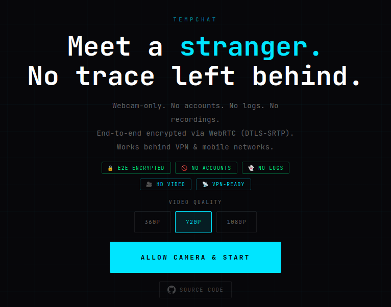

# TempChat

> Anonymous, webcam-only video calls. No accounts. No logs. No trace.

[](https://webrtc.org)
[](#privacy-model)
[](LICENSE)
[](#self-hosting)
[](#codec-priority)
[](#deploy-coturn-turn-server)

---



---

## What it is

TempChat is a privacy-first, 1-on-1 anonymous video chat. Share a link, connect, close the tab — gone. No backend stores anything. No accounts, no identity, no history.

Built for people who treat privacy as a default, not a premium feature.

**Live:** [teams.securityops.co](https://teams.securityops.co)

---

## How it works

```
Browser A ──── ScaleDrone WSS ────── Browser B
    │         (signaling only)           │
    └──────── WebRTC P2P (DTLS) ────────┘
              audio + video direct
              end-to-end encrypted
```

- **Signaling** via [ScaleDrone](https://www.scaledrone.com) WebSocket — only SDP and ICE candidates, never media
- **Media** is peer-to-peer, encrypted by WebRTC's built-in DTLS-SRTP
- **TURN relay** via self-hosted [coturn](https://github.com/coturn/coturn) — fallback for VPN users and strict symmetric NAT
- **Room IDs** are random hashes in the URL fragment — never sent to any server

---

## Features

### Video & Audio
- **AV1 → VP9 → H264 → VP8** codec negotiation — best mutually supported codec always wins
- Selectable quality: **360p / 720p / 1080p**
- Stereo Opus audio at 48 kHz with in-band FEC packet-loss recovery
- Temporal scalability (L1T3) — full-resolution video from frame one, no blur ramp-up at 1080p
- SDP bandwidth hints (`x-google-start-bitrate`) — eliminates 3–15s slow-start at high resolutions
- High start bitrate: 360p → 500 kbps, 720p → 2 Mbps, 1080p → 4.5 Mbps

### Privacy & Security
- Zero accounts, zero logs, zero recordings
- Camera and microphone activated **only after explicit user consent**
- Room IDs live in the URL hash — never stored on any server
- Direct P2P in most networks; TURN relay available as fallback for VPN/NAT
- Entire app is 2 files: `index.html` + `script.js` — auditable in minutes

### Connectivity
- Works behind **Mullvad, ProtonVPN, WireGuard** and other VPNs via TURN relay
- ICE restart on failure — recovers from network blips without page reload
- Deterministic offerer/answerer role by lexicographic client ID — no race conditions on simultaneous join

### Sharing
- Share invite link directly via **WhatsApp, Telegram, Signal, X, Email**
- Native OS share sheet on mobile (Web Share API)
- Share buttons on the landing page and inside the waiting overlay

### UX
- Full-viewport remote video with draggable PiP self-view
- Live stats panel: resolution, FPS, bandwidth, RTT, packet loss, active codec
- Direct P2P / TURN relay indicator
- Mute and camera toggle without renegotiation (uses `replaceTrack`)
- Mobile-optimised: `safe-area-inset`, 54 px touch targets, landscape support
- Zero dependencies — vanilla JS, no frameworks, no build step

---

## Stack

| Layer | Technology |
|---|---|
| Transport | WebRTC (DTLS-SRTP) |
| Signaling | ScaleDrone (WSS, observable room) |
| TURN relay | coturn 4.9 |
| Reverse proxy | Nginx Proxy Manager |
| WAF / IDS | CrowdSec + OpenAppSec |
| Frontend | Vanilla JS + HTML/CSS |
| Font | JetBrains Mono |
| Hosting | Self-hosted VPS (IONOS) |

---

## Codec priority

| Priority | Codec | Notes |
|---|---|---|
| 1 | **AV1** | ~30% better compression than VP9. Royalty-free. Chrome 90+, Firefox 136+, Edge 90+ |
| 2 | **VP9** | Solid fallback, excellent Chromium support |
| 3 | **H264** | Required for Safari / iOS — WebKit enforces H264 |
| 4 | **VP8** | Universal baseline, last resort |

Both peers negotiate the best mutually supported codec. Safari users get H264; two Chrome tabs get AV1 automatically.

---

## Self-hosting

### Requirements

- A VPS with a public IP (tested on IONOS)
- Docker + Docker Compose
- A domain with HTTPS (**required** — browsers block `getUserMedia` on plain HTTP)
- A free [ScaleDrone](https://www.scaledrone.com) account

---

### 1. Clone

```bash
git clone https://git.securityops.co/cristiancmoises/tempchat
cd tempchat
```

---

### 2. Serve static files with Nginx Proxy Manager

Copy files to the NPM data directory:

```bash
cp index.html script.js /DATA/AppData/nginxproxymanager/data/tempchat/
```

Fix ownership — NPM's nginx runs as uid 101:

```bash
chown -R 101:101 /DATA/AppData/nginxproxymanager/data/tempchat
chmod 755 /DATA/AppData/nginxproxymanager/data/tempchat
chmod 644 /DATA/AppData/nginxproxymanager/data/tempchat/*.{html,js}
```

In NPM **→ Proxy Hosts → your host → Advanced tab**:

```nginx
location / {
    root /data/tempchat;
    index index.html;
    try_files $uri $uri/ =404;

    add_header Permissions-Policy "camera=*, microphone=*" always;
    add_header Content-Security-Policy "
        default-src 'self';
        script-src 'self' https://cdn.scaledrone.com https://fonts.googleapis.com;
        style-src 'self' 'unsafe-inline' https://fonts.googleapis.com https://fonts.gstatic.com;
        font-src 'self' https://fonts.gstatic.com;
        connect-src 'self' wss://*.scaledrone.com https://*.scaledrone.com;
        media-src 'self' blob: mediastream:;
        img-src 'self' data:;
        worker-src 'self' blob:;
    " always;
}
```

Enable **Force HTTPS** on the proxy host. WebRTC requires HTTPS.

---

### 3. Configure ScaleDrone

1. Create a free account at [scaledrone.com](https://www.scaledrone.com)
2. Create a channel — copy the channel ID
3. Set it in `script.js`:

```js
const SCALEDRONE_CHANNEL = 'YOUR_CHANNEL_ID';
```

---

### 4. Deploy coturn (TURN server)

Without TURN, calls fail behind VPN or strict NAT. Takes ~5 minutes to deploy.

```bash
mkdir -p /opt/coturn && cd /opt/coturn
```

**`turnserver.conf`:**

```conf
listening-port=3478
tls-listening-port=5349
listening-ip=0.0.0.0
external-ip=YOUR_VPS_PUBLIC_IP
relay-ip=YOUR_VPS_PUBLIC_IP
min-port=49152
max-port=65535

# Generate: openssl rand -hex 32
static-auth-secret=YOUR_STRONG_SECRET

realm=yourdomain.com
no-multicast-peers
denied-peer-ip=10.0.0.0-10.255.255.255
denied-peer-ip=172.16.0.0-172.31.255.255
denied-peer-ip=192.168.0.0-192.168.255.255
denied-peer-ip=127.0.0.0-127.255.255.255
log-file=stdout
verbose
```

**`docker-compose.yml`:**

```yaml
services:
  coturn:
    image: coturn/coturn:latest
    container_name: coturn
    restart: unless-stopped
    network_mode: host        # required for TURN relay to work
    volumes:
      - ./turnserver.conf:/etc/coturn/turnserver.conf:ro
```

```bash
openssl rand -hex 32          # generate your secret, paste into turnserver.conf
docker compose up -d
docker logs coturn -f         # verify it starts cleanly
```

Set credentials in `script.js` — **no spaces in the values**:

```js
const TURN_HOST   = 'YOUR_VPS_PUBLIC_IP';  // e.g. '195.201.x.x'
const TURN_SECRET = 'YOUR_STRONG_SECRET';  // from openssl rand -hex 32
```

> ⚠️ **Common mistake:** placeholder strings like `'YOUR SERVER IP'` contain spaces.
> Spaces in a TURN hostname produce an invalid URL that crashes `RTCPeerConnection`
> construction silently — both users see nothing and the call never starts.
> Always use a real IP or domain with no spaces.

---

### 5. Firewall

#### IONOS Cloud Panel → Network → Firewall Policies

| Rule | Protocol | Port | Source | Purpose |
|---|---|---|---|---|
| HTTP | TCP | 80 | Any | HTTP → HTTPS redirect |
| HTTPS | TCP | 443 | Any | App + ScaleDrone WSS |
| SSH | TCP | your port | Your IP only | Administration |
| TURN/STUN | TCP + UDP | 3478 | Any | TURN relay |
| TURNS | TCP + UDP | 5349 | Any | TURN over TLS |
| TURN media | UDP | 49152–65535 | Any | TURN relay media |

#### nftables (`/etc/nftables.conf`)

Add inside `chain input`:

```nft
# TURN/STUN — required for coturn
tcp dport { 3478, 5349 } ct state new accept comment "TURN/STUN TCP"
udp dport { 3478, 5349 } ct state new accept comment "TURN/STUN UDP"
udp dport 49152-65535    ct state new accept comment "TURN relay media"
```

Apply:

```bash
nft -c -f /etc/nftables.conf   # syntax check
nft -f /etc/nftables.conf       # apply live
systemctl restart nftables
```

> STUN outbound (UDP 3478/5349) and ScaleDrone WSS (TCP 443) are already covered
> when `chain output` has `policy accept`.

---

## Usage

1. Open the app → **Allow Camera & Start**
2. Select video quality (default: 720p)
3. Share the link via the share buttons (WhatsApp, Telegram, Signal, X, Email) or copy it manually
4. When the other person opens the link and starts their camera, the call connects automatically

The room lives in the URL hash (`#abc123...`). Each page load generates a new random room. There is no matchmaking — you always connect with the specific person you share the link with.

---

## Privacy model

| What | Stored |
|---|---|
| Your identity | Never |
| Call audio / video | Never — direct P2P only |
| Room IDs | URL hash only — never on any server |
| IP address | Visible to remote peer in direct mode; hidden via TURN relay |
| Signaling messages | Transit only — ScaleDrone does not persist them |
| Camera / mic | Activated only after explicit user consent |

> **IP visibility:** In Direct P2P mode your IP is visible to the remote peer via WebRTC ICE candidates.
> For full IP privacy, use a VPN — the TURN relay handles connectivity automatically.

---

## Architecture notes

### Deterministic offerer / answerer

```js
// Both peers evaluate the same comparison independently
isOfferer = myClientId > otherClientId  // lexicographic
```

ScaleDrone does not guarantee the `members` array arrives in the same order on both clients. Role assignment by array position causes both peers to sometimes compute the same role, so nobody sends an offer and nothing happens. Lexicographic ID comparison is deterministic: exactly one peer gets `true`, regardless of array order or join timing.

### Track negotiation

The order in which local tracks are added relative to SDP creation is critical:

| Role | Method | Timing |
|---|---|---|
| Offerer | `addTransceiver()` | **Before** `createOffer()` — defines m-lines, sets codec prefs |
| Answerer | `addTrack()` | **After** `setRemoteDescription(offer)` — maps onto offerer's m-lines |

Using `addTransceiver()` on the answerer side creates new conflicting m-lines, causing one-sided or no video.

### 1080p performance

Three mechanisms eliminate the 3–15 second startup delay:

**1. SDP bandwidth hints** — injected before `setLocalDescription`:
```
b=AS:6000
a=fmtp:96 x-google-start-bitrate=4500;x-google-max-bitrate=6000
```
`x-google-start-bitrate` tells Chrome's GCC congestion controller to begin at 4.5 Mbps instead of the default 300 kbps, cutting ramp-up from ~10s to under 1s.

**2. Temporal scalability (L1T3):**
```js
enc.scalabilityMode = 'L1T3';
```
The encoder produces 3 temporal layers. The decoder receives full-resolution frames from the first keyframe while the encoder adapts delivery rate to bandwidth. Sharp 1080p from frame one with no blur period.

**3. Fast parameter application** — `applyEncodingParams()` fires 500ms after connection instead of 1500ms, so the bitrate ceiling takes effect before the first significant video frames are decoded on the remote side.

### ICE restart

On `iceConnectionState === 'failed'` or `'disconnected'`, the offerer calls `pc.restartIce()` after a short grace period (4s / 3s). This recovers from transient network disruptions without a page reload.

### Bitrate targets

| Quality | Max bitrate | Start bitrate |
|---|---|---|
| 360p | 700 kbps | 500 kbps |
| 720p | 3 Mbps | 2 Mbps |
| 1080p | 6 Mbps | 4.5 Mbps |
| Audio (all) | 128 kbps stereo Opus | — |

---

## Troubleshooting

| Symptom | Likely cause | Fix |
|---|---|---|
| Nothing happens when second person joins | Invalid TURN credentials with spaces in hostname | Set `TURN_HOST = ''` or use a real IP/domain |
| One side sees video, other side black | Wrong track negotiation order | Answerer must use `addTrack()` after `setRemoteDescription()` |
| Both sides see only themselves | Both computed same role (race condition) | Fixed in current version via lexicographic ID comparison |
| Connection fails behind VPN | No TURN server | Deploy coturn and configure credentials |
| 1080p blurry for several seconds | GCC congestion slow-start | Ensure SDP bandwidth hints and L1T3 mode are active |
| `getUserMedia` blocked | HTTP instead of HTTPS | Serve over HTTPS or use ngrok for local testing |
| Camera permission denied | Browser site permissions blocked | Check browser settings, grant camera/mic access |

---

## Development

No build step. Edit `index.html` and `script.js` directly.

```bash
# Serve locally
npx serve .
# or
python3 -m http.server 8080

# Expose over HTTPS (required for camera access)
ngrok http 8080
```

Open two tabs to the same ngrok URL with the same hash (`#testroom`) to simulate a full call locally.

**Expected console output on successful connection:**

```
[tc] ICE: STUN-only
[tc] ScaleDrone open, clientId: abc12345
[tc] room open: observable-abc123...
[tc] members: 2 ['abc12345', '789xyz00']
[tc] role: OFFERER | me: abc12345 | peer: 789xyz00
[tc] offer sent ✓
[tc] remote desc set (answer) ✓
[tc] ICE: connected
[tc] remote video attached ✓
[tc] connection state: connected
```

---

## License

MIT — see [LICENSE](LICENSE)

---

<div align="center">
  <sub>
    Built by <a href="https://github.com/cristiancmoises">@cristiancmoises</a>
    &nbsp;·&nbsp;
    <a href="https://securityops.co">securityops.co</a>
    &nbsp;·&nbsp;
    <a href="https://teams.securityops.co">Live demo</a>
  </sub>
</div>
